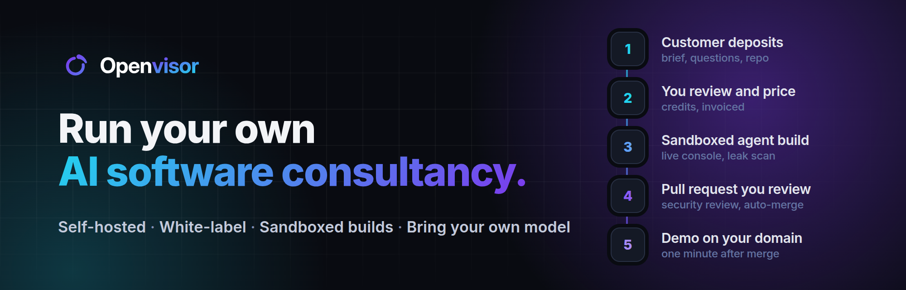
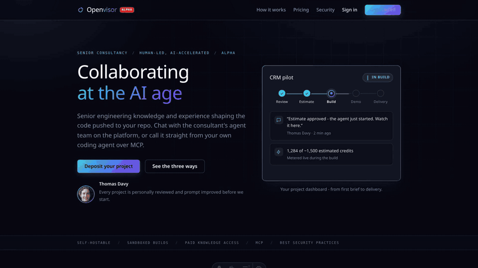

<p align="center"></p>

<div align="center">

**Your AI-native consulting agency, running 24/7 for you.**

Works with **GitHub**, **GitLab**, any **OpenAI-compatible** model and any **MCP** client.

See it live: [berwick.ai](https://berwick.ai) is a real consulting practice running on Openvisor, white-labelled and in production.

</div>

<br>

<div align="center">

[](LICENSE) [](#docs) [](#what-you-get) [](https://github.com/sponsors/flavienbwk)
[](https://github.com/scalevisor-io/openvisor/actions/workflows/e2e.yml)

</div>

<div align="center">

[How it works](#how-it-works) · [What you get](#what-you-get) · [Quick start](#quick-start) · [Production](#production) · [Bring your own model](#bring-your-own-model) · [Make it yours](#make-it-yours) · [Docs](#docs)

</div>

---

<p align="center"><a href="docs/assets/openvisor-demo-short.mp4"></a></p>
<p align="center"><a href="docs/assets/openvisor-demo-short.mp4">Watch the full demo (62 seconds, MP4)</a></p>

## Quick start

**With your AI assistant.** Copy/paste:

```txt
Read instructions at https://github.com/scalevisor-io/openvisor/blob/main/docs/DEPLOY_WITH_AI.md to deploy my own Openvisor instance.
```

**Or by hand.**

```bash
git clone https://github.com/scalevisor-io/openvisor.git && cd openvisor
cp .env.example .env # update envs!

echo "127.0.0.1 openvisor.local app.openvisor.local mail.openvisor.local mcp.openvisor.local" | sudo tee -a /etc/hosts
make dev
```

| | |
| --- | --- |
| Landing | http://openvisor.local |
| App | http://app.openvisor.local (sign in with `ADMIN_EMAIL` / `ADMIN_PASSWORD`) |
| Mail | http://mail.openvisor.local (Mailpit) |

Two switches worth knowing: the sign-in captcha only runs in a secure context, so on plain http set `ALTCHA_ENABLED=0`; and `OPENHANDS_ENABLED=0` (the default) pushes a deterministic scaffold through the real PR → merge → demo path at zero token cost, `1` builds with the agent.

## How it works

Coding agents write code. Openvisor is the consultancy around them: the customer portal, the review gate, the sandbox, the demo and the billing. You stay the consultant: the agent can never price, approve or advance a project.

| | Step | What happens |
| --- | --- | --- |
| 1 | **Deposit** | A customer describes the project on your white-label site, answers your onboarding questions and connects a GitHub or GitLab repo. |
| 2 | **Evaluate** | Moderation, feasibility and a credit estimate run automatically. Doubts are flagged to you, never auto-accepted. |
| 3 | **Price** | You approve or answer with a direct quote. The customer tops up credits through Stripe, invoiced with tax. |
| 4 | **Plan** | The agent writes a plan the customer approves in the thread before anything is built. |
| 5 | **Build** | One disposable sandbox per run, secrets as env vars, a live console with token counters and a Stop button. |
| 6 | **Publish** | Leak scan, then a pull request under your review. Security review and auto-merge if you allow it. |
| 7 | **Demo** | Boot-tested, then live on `<project>.<your-domain>` behind basic auth. Merge the PR and the demo redeploys within a minute. |
| 8 | **Deliver** | Follow-up requests get their own run, PR and thread. The customer approves delivery. |

## What you get

| | |
| --- | --- |
| 🧑‍💼 **Customer portal** | Deposit, live status, one thread per project and per request, PR links, usage, delivery approval. |
| 📺 **Live build console** | Phases, commands, edits, browsing, git, security review, token and credit counters, Stop. |
| 🔌 **MCP for their agent** | A project token lets Claude Code, Cursor or any MCP client consult the codebase, delegate work and search your knowledge. |
| ⏱️ **Programs and routines** | Runnable repos on a cron schedule or an inbound webhook; scheduled prompts that become ordinary requests. |
| 🎨 **Custom branding** | Your brand, consultant name and focus from `.env`; your landing copy; 20 prompt templates you edit as files. |
| 📚 **Knowledge bases** | Add knowledge to enrich your harness. Local folder, git repos, MCP servers, Context7, web search. Switched on/off per project. |
| 🛠️ **Tools** | MCP servers the agent acts through (GitHub, GitLab, web research, yours), with a tool-poisoning scan on every enable. |
| 🧠 **Any model** | OpenAI-compatible endpoints, chosen per project, with a one-token probe for chat, reasoning effort and vision. |
| 💳 **Billing** | Stripe integration with prepaid credits at your markup, per-model prices, invoices with automatic tax. |
| 🔒 **Sandbox and leak scan** | One container per build (Sysbox in production), an egress allowlist, and a scan of staged files, commit messages and added lines before any push. |
| 🔐 **Encrypted secrets** | Envelope encryption for every secret and Memory value. Secrets reach the sandbox through a sourced-then-deleted file, never `docker -e`. |
| 🛡️ **Guardrails** | A forbidden-actions floor the model cannot lower, a retrieval score floor against corpus extraction, proof-of-work captcha, rate limits, an audit log. |
| ☸️ **Compose or Kubernetes** | One VM with docker compose behind Traefik, or the Helm chart built from the same images. |

## Production

Recommended deployment: with Kubernetes so you have truly-isolated pods to run each agentic task.

One VM: a real `.env`, apex and wildcard DNS records, a wildcard TLS certificate in `traefik/certs/`, [Sysbox](https://github.com/nestybox/sysbox) for hardened sandboxes, `make prod`. Or Kubernetes with the Helm chart in `k8s/` (`make helm-bpdr`). The same [docs/DEPLOY_WITH_AI.md](docs/DEPLOY_WITH_AI.md) prompt handles production too.

## Bring your own model

Three OpenAI-compatible endpoints (chat, embeddings, reranking): OpenAI, Anthropic, Mistral, OpenRouter, a European gateway or your own vLLM server, per instance or per project. A model needs a row in `backend/app/static_data/per_model_price_table.json` (or prices on its saved endpoint), otherwise the platform refuses to run it rather than bill zero.

## Make it yours

| What | Where |
| --- | --- |
| Brand, consultant name, consulting focus, colours | the `# Brand` block in `.env` |
| Landing copy | `landing/src/data/site.example.yml` → `site.yml` |
| Offer catalogue, onboarding questions, Memory suggestions | `backend/app/static_data/*.example.json` |
| Knowledge | the `./knowledge` folder, git repos and MCP servers from the admin Knowledge-bases page |
| Agent behaviour | the versioned prompts in `backend/app/agents/prompts/` ([rules](docs/DEPLOY_WITH_AI.md#customizing-agent-behavior)) |

## Docs

| Goal | Start here |
| --- | --- |
| Develop on it | [CLAUDE.md](CLAUDE.md) - conventions, workflows, gotchas |
| Understand a subsystem | [docs/CODE_MAP.md](docs/CODE_MAP.md) - the tour, and the dev pipeline end to end |
| Call the API | [docs/API_CONTRACT.md](docs/API_CONTRACT.md) |
| Bill customers | [docs/stripe-billing.md](docs/stripe-billing.md) |
| Run builds in parallel | [docs/PARALLEL_BUILDS.md](docs/PARALLEL_BUILDS.md) |
| Test | `make test` (1,000+ backend tests) and the end-to-end scenario in [`.claude/commands/e2e-check.md`](.claude/commands/e2e-check.md) |

Stack: FastAPI, SQLAlchemy, Celery, Postgres + pgvector, Redis, Meilisearch, Traefik, OpenHands SDK, React + Vite, Astro, Helm.

## Status

Alpha. Openvisor already runs a real consulting practice in production ([berwick.ai](https://berwick.ai)); expect breaking changes between releases, always with migrations.

## Contributing

Issues and pull requests are welcome. Read [CLAUDE.md](CLAUDE.md) first: one branch and one pull request per change, `make test` green, docs updated in the same PR.

## License

[Apache-2.0](LICENSE). "Openvisor" and "Scalevisor" are trademarks of the project maintainers; the license does not grant rights to use them. If Openvisor earns you money, consider [sponsoring its development](https://github.com/sponsors/flavienbwk).
